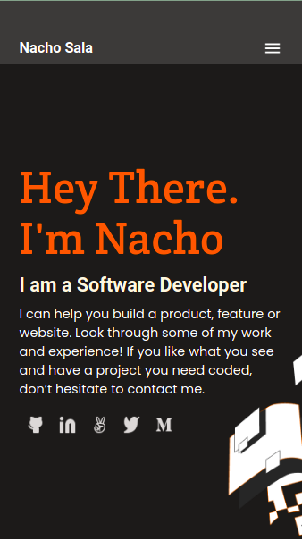

# My Portfolio

> This project is proposed by Microverse to prepare our professional portfolio from the first week.

## Built With

- HTML
- CSS

## Live Demo

[My portfolio](https://nachosala89.github.io/my-portfolio/)

## Getting Started

To get a local copy up and running follow these simple example steps:
- Clone the repo to your computer.
- Open index.html in your browser.

👤 **Author1**

- GitHub: [@nachosala89](https://github.com/nachosala89)
- Twitter: [@nachosala89](https://twitter.com/nachosala89)
- LinkedIn: [Juan Ignacio Sala](https://www.linkedin.com/in/juan-ignacio-sala)

## 🤝 Contributing

Contributions, issues, and feature requests are welcome!

Feel free to check the [issues page](../../issues/).

## Show your support

Give a ⭐️ if you like this project!

## 📝 License

This project is [MIT](./MIT.md) licensed.